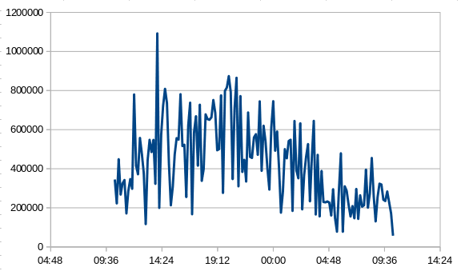
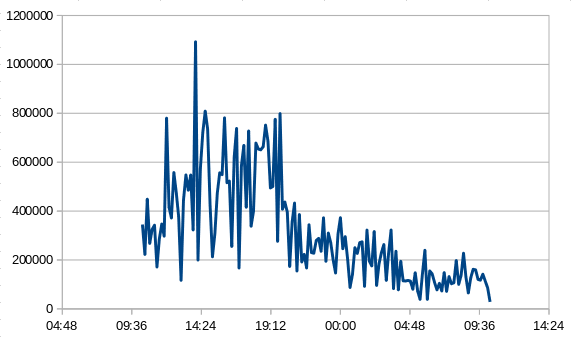

# Using the WE Rules

lede

## Intro
hideen asssumptions -- normal distribution
in classis example, number of sampeps use for eahc point, but we're using individial points
actuall makes the 0.XX% of over-re signa not rtigger: it's a cheat (;-))

we use number of samppe,s in the moving average, 
too few means false negatives, missed spikes
too many means we can't adapt to day/night variations

## Getting Some Good Examples

Start with a day with "nothing unusual"
I have one, which turned out to have some anomalies that we hadn't noticed. 

plot it as a distribution

OK, definitely a bigger right tail than left but not horrid

Now ture 

start with somthing you want to detect.
in tge blog, I had revenue fall in half.
OK, take a sample day's data and stick it in a spreadsheet

Jump in and chop it in half during the middle of the day

Now you have a sample that you expect to contain an anomaly at 2000 hours (8 PM)
to adjust the sample size with

## Tuning parameters

Now we try running the tool, and look for a warning