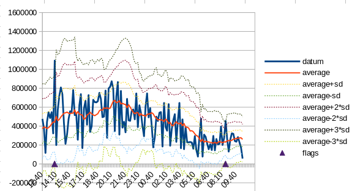
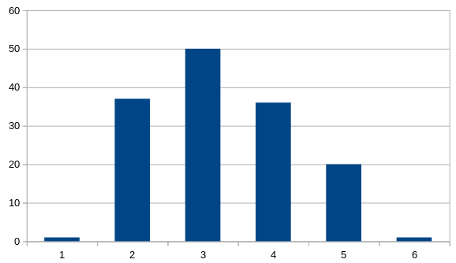
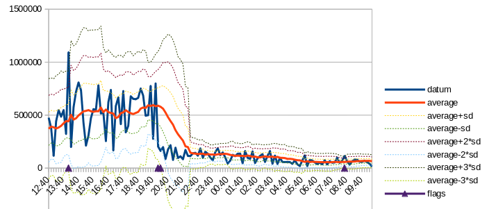

# Using the WE Rules

This is the cheat-sheet on how to get started using the tool.

## Intro

The Western Electric rules look for anomalies in sequences of numbers, 
using statistics.  I love it because my other tools are underwhelming: they can tell me if I hit 100% CPU, zero memory other extremely easy things, whihile I want 
to see if errors jumped by over 10%, revenue fell by more than 25%, or requests were 10% below what they were at the same time yesterday.

It does have a few hidden assumptions and tuning parameters.
* It works for normal (non-skewed) distributions.
* The number of data-points grouped into each sample is a hidden adjustment knob. 
  * As you average more points into each sample, the rules become less sensitive to outliers and "noise", but also less accurate.
* Because we use a moving average to compare against, the number of samples is also a tuning knob:
  * too few samples in the average means spikes can be missed, causing false negatives
  * to many samples in the average means normal day/night variation will be seen as anomalies, causing false positives.

## Getting Some Good Examples

Because it needs tuning, the first thing we need is good examples of "normal" and "anomalous"

Start with a day with "nothing unusual", to see if it is a normal distribution.
I have one saved from Grafana, which turned out to have some anomalies that we hadn't noticed.
Those are where the bottom line has little up-arrows, flagging two spikes.

Plot it as a distribution and see if it's normal:

OK, it definitely has a bigger right tail than left but not by a lot.
This can be our test case.

# Create an Anomaly You Want to Detect

Now we create an example of something we want to detect.
In the blog article, I had revenue fall in half, so as an example, we take
our sample, stick it in a spreadsheet and chop the values in half 
in the middle of the graph (20:00 hours, 8 PM GMT)

Now we can test and see what the rules detect

## With All Defaults

Here we see an extra anomaly, around 23:00, but the change we made was at 20:00.
Thta suggest we didn't have a long enough period for our  moving average, and it missed the big step-fuction that we were trying to spot.

The default was --nSamples 5 means we chose 5 of our 10-minute samples, just under an hour.
Let's try two hours, --nSamples 13

Ah, that's better!
We have a long enough moving average that the step is spotted as it happens,
but at tye same time we aren't misinterpreting the gentle sine-wave of dav vs night for an anomaly.

## Setting up for production

The program is mildly useful when looking at samples in a spreadsheet, but
we wanted it as a step in a reporting and alerting pipeline.

That will take a few pipe-fittings
* tail -f | awk '{ print $1, $6}' to get the fields you want to plot, a timestamp and the metric of interest.
* awk to format the output into stream for your plot and altering programs of preference
* alerting settings that will recognize the step function for immediate action, but just mark the spikes or the NOC team to review.

We expect to see 0.17% of the data fall outside three standard deviations, 
so there will always be cases where humans will need to look at the output
of your alerting program, and decide if they need to act on it.  

The 
strength of the Western Electric rules is that we can tune them to cut down
the number of false alarms to something that won't drive the on-call engineer mad (;-))

